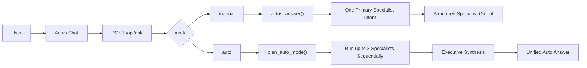

# Actus

Actus is a monorepo for a credit operations copilot: a React frontend, a FastAPI backend, an intent-routed analytics layer, and a Pinecone-backed `new_design` RAG runtime.

## Repo layout

- `backend/`: FastAPI API, Actus intent router, RAG runtime, indexing scripts, tests, Fly.io deploy config
- `frontend/`: React 19 + TypeScript + Vite UI
- `scripts/`: project-level helper scripts
- Root docs:
  - `ACTUS_TECHNICAL_SPECS.md`
  - `LLM_ROUTING_ARCH.md`
  - `Commercial_README.md`
  - `SECURITY_BACKEND_HARDENING.md`

## What Actus does

- `POST /api/ask` supports `manual` and `auto` ask modes
- Manual mode routes one query to one primary specialist intent
- Auto mode orchestrates up to 3 specialist intents sequentially, then returns one synthesized executive answer
- Structured analysis endpoints support tickets, items, and accounts/customers
- RAG search and answer flows run through the `new_design` pipeline only
- Firebase RTDB provides operational data and user context lookup
- Quality telemetry is recorded to a local SQLite database and exposed through `/api/quality/*`

Current intent coverage includes:

- Analyze account
- Analyze ticket
- Analyze item
- Ticket status
- Record lookup
- Customer history
- Mixed lines
- Credit activity
- Credits with RTN
- Priority tickets
- Credit aging
- Stalled tickets
- Credit overview
- Root causes
- Top accounts, sales reps, and items
- Credit trends and anomalies
- Investigation notes
- System updates with RTN
- Credit ops snapshot
- Credit amount chart
- Bulk search

`GET /api/help` returns the current help text sourced from `backend/actus/help_text.py`.

## Ask modes

`POST /api/ask` accepts:

```json
{
  "query": "give me a credit overview for the last month",
  "mode": "manual"
}
```

`mode` values:

- `manual`: default; runs the normal Actus intent router and returns the primary specialist response with its native cards, tables, and charts
- `auto`: plans the query, runs up to 3 existing specialist intents sequentially, and returns one synthesized markdown answer with executed-intent chips and in-chat follow-ups

Auto mode uses two planning families:

- `entity`: ticket, item, customer/account, and optional investigation notes
- `portfolio`: overview, RTN updates, anomalies, root causes, trends, aging, and ops snapshot

Planner behavior:

- Deterministic-first planner using current intent/entity detection
- Optional LLM planning fallback only when `ACTUS_INTENT_CLASSIFIER` is enabled
- Final synthesis uses OpenRouter when available, with deterministic fallback if synthesis fails

Architecture:



Manual and Auto share the same underlying specialist intents, cached credit dataset, RAG runtime, Pinecone retrieval, and OpenRouter integrations. The difference is orchestration and presentation.

## Stack

- Frontend: React 19, TypeScript 5.9, Vite 7, Tailwind CSS 3.4, Recharts, `react-markdown`, `remark-gfm`
- Backend: Python 3.11+, FastAPI, Uvicorn, pandas, Firebase Admin SDK
- RAG: `sentence-transformers`, Pinecone, canonical ticket snapshots, deterministic next-action rules
- Deployment: Fly.io backend under `backend/fly.toml`

## Prerequisites

- Python 3.11+
- Node 20.19+ or 22.12+ (`vite` 7 requires this range)
- npm
- Firebase RTDB credentials
- Pinecone index credentials for RAG
- OpenRouter API key if you want LLM-backed fallback, summarization, or highlight generation

## Backend setup

```bash
cd backend
python3 -m venv .venv
source .venv/bin/activate
python -m pip install -r requirements.txt
cp .env.example .env
```

Update `backend/.env` with the values your environment needs.

### Core backend environment

| Variable | Required | Notes |
| --- | --- | --- |
| `ACTUS_ENV` | No | Environment label used by some scripts |
| `ACTUS_FIREBASE_URL` | Usually | Firebase RTDB URL; the code falls back to the default Actus RTDB URL if omitted |
| `ACTUS_FIREBASE_JSON` or `ACTUS_FIREBASE_PATH` | Yes | Service account JSON inline or file path |
| `ACTUS_RAG_PROVIDER` | No | Defaults to `pinecone`; legacy local providers are removed |
| `ACTUS_PINECONE_API_KEY` | Yes for RAG | Pinecone API key |
| `ACTUS_PINECONE_INDEX` | Yes for RAG | Pinecone index name |
| `ACTUS_PINECONE_NAMESPACE` | Recommended | Namespace for Actus vectors |
| `ACTUS_PINECONE_TICKET_TOP_K` | No | Ticket search limit; defaults to `500` |

### OpenRouter environment

| Variable | Required | Notes |
| --- | --- | --- |
| `ACTUS_OPENROUTER_API_KEY` | Optional | Required for OpenRouter-backed flows |
| `ACTUS_OPENROUTER_MODEL` | Optional | Primary chat model |
| `ACTUS_OPENROUTER_MODEL_FALLBACK` | Optional | Fallback chat/classifier model |
| `ACTUS_OPENROUTER_SUMMARY_MODEL` | Optional | Preferred summarization model for Auto synthesis and other summary flows |
| `ACTUS_OPENROUTER_SUMMARY_MODEL_FALLBACK` | Optional | Fallback summarization model |
| `ACTUS_OPENROUTER_HIGHLIGHTS_MODEL` | Optional | Ticket highlight model |
| `ACTUS_OPENROUTER_HIGHLIGHTS_MODEL_FALLBACK` | Optional | Fallback ticket highlight model |
| `ACTUS_OPENROUTER_MODE` | Optional | `always` or `fallback` for `/api/ask` |
| `ACTUS_OPENROUTER_SYSTEM` | Optional | System prompt override for `/api/ask` |
| `ACTUS_INTENT_CLASSIFIER` | Optional | Enables OpenRouter intent classification and Auto mode planning fallback |
| `ACTUS_INV_NOTE_SUMMARY` | Optional | Enables investigation-note summarization |
| `ACTUS_INV_NOTE_SUMMARY_MAX_CHARS` | Optional | Input size cap for investigation-note summarization |

### Security and runtime environment

| Variable | Required | Notes |
| --- | --- | --- |
| `ACTUS_API_KEY` | Optional | Protects `/api/*` and `/rag/*` routes except `/api/health` and `/api/health/openrouter` |
| `ACTUS_CORS_ORIGINS` | Optional | Comma-separated allowlist |
| `ACTUS_CORS_ORIGIN_REGEX` | Optional | Regex for dynamic origins such as ngrok |
| `ACTUS_PRELOAD_NEW_RAG` | Optional | Defaults to enabled; warms the RAG service at startup |
| `ACTUS_RAG_REBUILD_SEC` | Optional | Disabled by default; enables periodic in-process rebuilds |
| `ACTUS_NEW_RAG_DATA_DIR` | Optional | Override default `backend/rag_data/new_design` output path |
| `ACTUS_RAG_CHUNKS_DB_PATH` or `ACTUS_NEW_RAG_CHUNKS_DB_PATH` | Optional | Override local chunk DB path |
| `ACTUS_RAG_CANONICAL_SNAPSHOT_PATH` or `ACTUS_NEW_RAG_CANONICAL_SNAPSHOT_PATH` | Optional | Override canonical snapshot path |
| `ACTUS_QUALITY_DB_PATH` | Optional | Override quality metrics SQLite path |
| `ACTUS_RELEASE_TAG` | Optional | Labels quality metrics and summary filters |
| `ACTUS_HF_LOCAL_ONLY` | Optional | Restricts sentence-transformer loads to local cache |

## Frontend setup

```bash
cd frontend
npm install
```

Optional `frontend/.env.local` values:

```bash
VITE_API_BASE_URL=http://127.0.0.1:8000
VITE_USER_EMAIL=you@example.com
VITE_USER_NAME=Your Name
# or
VITE_USER_FIRST_NAME=YourName
```

Notes:

- In local dev, Vite proxies both `/api` and `/rag` to `http://localhost:8000`, so `VITE_API_BASE_URL` is usually not needed.
- `VITE_API_BASE` is also supported as an alternate API base variable.
- `VITE_USER_NAME`, `VITE_USER_FIRST_NAME`, and `VITE_USER_EMAIL` are optional conveniences for local user-context behavior.

## Run locally

Backend:

```bash
cd backend
source .venv/bin/activate
set -a
source .env
set +a
uvicorn main:APP --reload --port 8000
```

Frontend:

```bash
cd frontend
npm run dev
```

The frontend dev server listens on `http://localhost:5173` and proxies both `/api` and `/rag` to the backend on `http://localhost:8000`.

## Main API surface

Core API:

- `POST /api/ask`
- `GET /api/help`
- `GET /api/health`
- `GET /api/health/openrouter`
- `GET /api/user-context?email=...`

Quality API:

- `GET /api/quality/summary`
- `GET /api/quality/trends`

RAG API:

- `GET /rag/health`
- `GET /rag/ticket/{ticket_id}/refs`
- `POST /rag/next-action/trace`
- `POST /rag/new/search`
- `POST /rag/new/answer`
- `POST /rag/new/refresh`
- `POST /rag/new/item-analysis`
- `POST /rag/new/customer-analysis`
- `POST /rag/new/ticket-analysis`

If `ACTUS_API_KEY` is set, include `x-api-key: $ACTUS_API_KEY` on protected `/api/*` and `/rag/*` requests.

`POST /api/ask` request body:

- `query`: required user message
- `mode`: optional `manual | auto`; defaults to `manual`

## Example requests

Manual chat:

```bash
curl -sS -X POST http://127.0.0.1:8000/api/ask \
  -H 'Content-Type: application/json' \
  -d '{"query":"Actus, analyze ticket R-048484","mode":"manual"}' | jq
```

Auto chat:

```bash
curl -sS -X POST http://127.0.0.1:8000/api/ask \
  -H 'Content-Type: application/json' \
  -d '{"query":"give me a credit overview for the last month","mode":"auto"}' | jq
```

Auto entity example:

```bash
curl -sS -X POST http://127.0.0.1:8000/api/ask \
  -H 'Content-Type: application/json' \
  -d '{"query":"analyze ticket R-067298 with investigation notes and evidence","mode":"auto"}' | jq
```

Auto portfolio example:

```bash
curl -sS -X POST http://127.0.0.1:8000/api/ask \
  -H 'Content-Type: application/json' \
  -d '{"query":"show me system RTN updates analysis for the current month","mode":"auto"}' | jq
```

Ticket analysis:

```bash
curl -sS -X POST http://127.0.0.1:8000/rag/new/ticket-analysis \
  -H 'Content-Type: application/json' \
  -d '{"ticket_id":"R-048484","threshold_days":30}' | jq
```

Item analysis:

```bash
curl -sS -X POST http://127.0.0.1:8000/rag/new/item-analysis \
  -H 'Content-Type: application/json' \
  -d '{"item_number":"1007986"}' | jq
```

Customer analysis:

```bash
curl -sS -X POST http://127.0.0.1:8000/rag/new/customer-analysis \
  -H 'Content-Type: application/json' \
  -d '{"customer_query":"SGP","match_mode":"auto","threshold_days":30}' | jq
```

RAG search:

```bash
curl -sS -X POST http://127.0.0.1:8000/rag/new/search \
  -H 'Content-Type: application/json' \
  -d '{"query":"price loaded after invoice","top_k":8}' | jq
```

Next-action trace:

```bash
curl -sS -X POST http://127.0.0.1:8000/rag/next-action/trace \
  -H 'Content-Type: application/json' \
  -d '{
    "ticket_id": "R-012345",
    "reason_for_credit": "PPD mismatch",
    "snippets": [
      {"text": "ticket R-012345 summary: invoice: INV14068709 customer: DWC01", "chunk_type": "summary"}
    ]
  }' | jq
```

Health checks:

```bash
curl -sS http://127.0.0.1:8000/api/health | jq
curl -sS http://127.0.0.1:8000/api/health/openrouter | jq
curl -sS http://127.0.0.1:8000/rag/health | jq
```

## RAG runtime and indexing

- `new_design` is the only supported RAG pipeline; legacy local/FAISS behavior has been removed.
- The canonical build entrypoint is `backend/scripts/build_rag_index.py`.
- The default local data output is under `backend/rag_data/new_design`.
- If Pinecone credentials are missing, the build script still rebuilds the canonical snapshot and skips remote vector indexing.

Build the index locally:

```bash
cd backend
source .venv/bin/activate
python scripts/build_rag_index.py
```

Refresh runtime data from Firebase:

```bash
curl -sS -X POST http://127.0.0.1:8000/rag/new/refresh \
  -H 'Content-Type: application/json' \
  -d '{"index": true}' | jq
```

Deterministic next-action rules live in `backend/config/next_action_rules.json`.

## Quality metrics

- Quality events are stored in SQLite at `backend/rag_data/quality_metrics.sqlite` by default.
- `GET /api/quality/summary` provides rollups for a window such as `28d`.
- `GET /api/quality/trends` provides grouped trends, defaulting to weekly buckets over `12w`.
- `ACTUS_RELEASE_TAG` can be used to segment quality metrics by deployment/release.

## Tests and checks

Backend:

```bash
cd backend
source .venv/bin/activate
python -m pytest -q tests
```

Frontend:

```bash
cd frontend
npm run build
npm run lint
```

## Deployment

- Fly.io config lives at `backend/fly.toml`
- The backend image is built from `backend/Dockerfile`
- Fly runs the app process with `.venv/bin/uvicorn main:APP --host 0.0.0.0 --port 8000`

Scheduled index rebuild example:

```bash
flyctl machines run \
  --app <fly-backend-app> \
  --schedule "*/15 * * * *" \
  --command "python" \
  -- \
  scripts/build_rag_index.py
```

If your deployed working directory is not the backend root, add the appropriate `--workdir` value for your image layout.

## Related docs

- `ACTUS_TECHNICAL_SPECS.md`: broader technical summary
- `LLM_ROUTING_ARCH.md`: model and routing architecture notes
- `Commercial_README.md`: commercial positioning and launch messaging
- `SECURITY_BACKEND_HARDENING.md`: security backlog and hardening plan
